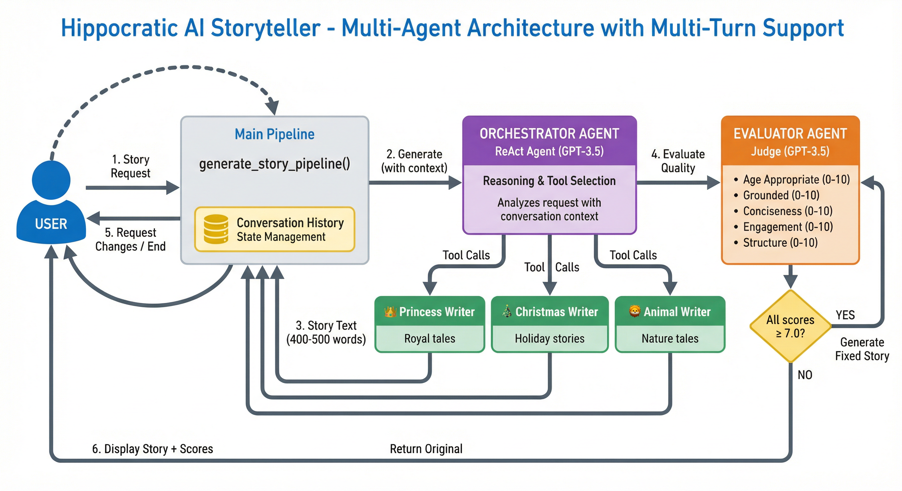
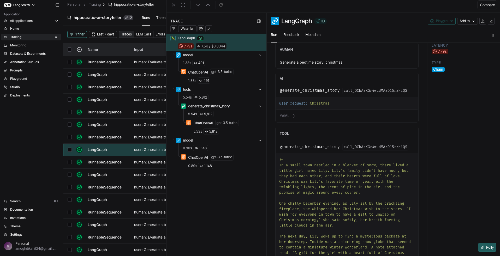

# System Architecture



## Overview
Multi-agent storytelling system with specialized writers and LLM judge for quality assurance. Uses ReAct agent pattern for intelligent tool selection.

## Components

### 1. User Interface (`main.py`)
- Entry point: accepts story requests
- Pipeline orchestration: `generate_story_pipeline()`
- Output formatting with scores and feedback

### 2. Orchestrator Agent (`agents/orchestrator.py`)
**Role**: ReAct agent for reasoning and tool selection  
**Model**: GPT-3.5-turbo (temp=0.1 for consistency)  
**Function**: 
- Analyzes user request semantically
- Reasons about genre/theme
- Calls appropriate writer tool
- Returns generated story text

**Tools Available**:
- `generate_princess_story` - Royal tales, magic, castles
- `generate_christmas_story` - Holiday stories, giving, joy
- `generate_animal_story` - Nature tales, animal wisdom

### 3. Specialized Writers (`agents/writers/`)
**Role**: Domain-expert story generators  
**Model**: GPT-3.5-turbo (temp=0.7 for creativity)  
**Features**:
- Chain-of-Thought prompting with 5-step structure
- Few-shot examples loaded from `examples/` folder
- Strict 400-500 word requirement
- Age-appropriate guidelines (5-10 years)

### 4. Evaluator Agent (`agents/evaluator.py`)
**Role**: LLM judge with quality rubric and fixing capability  
**Model**: GPT-3.5-turbo (temp=0.1 for objective scoring)  
**Rubric** (each 0-10):
1. Age Appropriate - suitable for 5-10 years
2. Grounded - coherent, logical flow
3. Conciseness - 400-500 words
4. Engagement - captivating for children
5. Structure - clear beginning/middle/end

**Decision Logic**:
- Overall score = average of 5 dimensions
- If all scores ≥ 7.0 → approve original story
- If any score < 7.0 → generate fixed story
- Uses Pydantic structured output for reliability

## Flow

```
User Request
    ↓
[1] Orchestrator reasons & selects writer tool
    ↓
[2] Writer generates 400-500 word story
    ↓
[3] Evaluator scores on 5 dimensions
    ↓
Decision: All ≥ 7.0?
    ├─ YES → Return original story
    └─ NO  → Generate fixed story → Return fixed version
    ↓
User receives story + scores + feedback
```

## Key Design Decisions

1. **ReAct Agent Pattern**: Enables semantic understanding vs keyword matching for tool selection
2. **Specialized Writers**: Domain expertise with tailored prompts and examples
3. **Self-Healing System**: Evaluator automatically fixes low-scoring stories
4. **Structured Output**: Pydantic models ensure reliable scoring format
5. **CoT Prompting**: Writers follow explicit 5-step structure for consistent quality
6. **Low Temperature Evaluation**: Ensures objective, consistent scoring (temp=0.1)
7. **High Temperature Creation**: Enables creativity in story generation (temp=0.7)

## Observability & Debugging

The system integrates **LangSmith tracing** for complete observability of multi-agent interactions:



**Key Capabilities**:
- **Full trace visibility**: Track orchestrator reasoning → tool selection → writer execution → evaluation
- **Latency monitoring**: Identify bottlenecks in the agent pipeline (7.79s total in example)
- **Cost tracking**: Monitor token usage per agent ($0.0044 per story generation)
- **Debug agent decisions**: View exact prompts, tool calls, and LLM responses
- **Production monitoring**: Track performance across multiple story requests

**Trace Components Visible**:
1. `LangGraph` - Overall orchestration flow
2. `ChatOpenAI` - Individual LLM calls with model and temperature
3. `tools` - Tool invocations (e.g., `generate_christmas_story`)
4. `model` - LLM reasoning and responses

Enable tracing by setting `LANGCHAIN_TRACING_V2=true` in `.env` file.

## Tech Stack
- LangChain 0.3+ - Agent orchestration & tool calling
- OpenAI GPT-3.5-turbo - All LLM operations
- Pydantic v2 - Structured output validation
- LangSmith - Observability & tracing
- Python 3.10+
